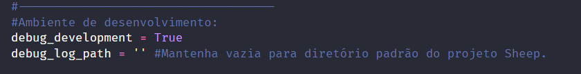
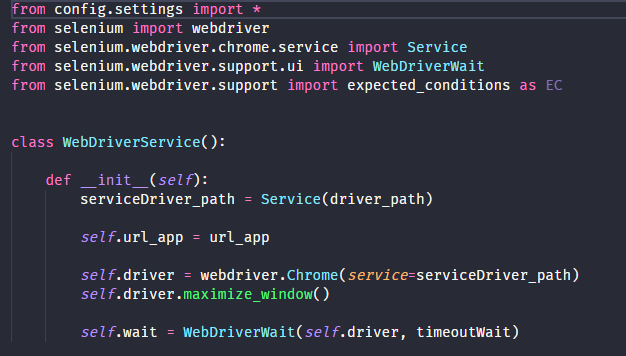
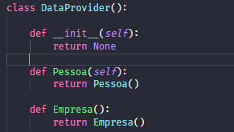
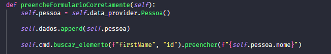
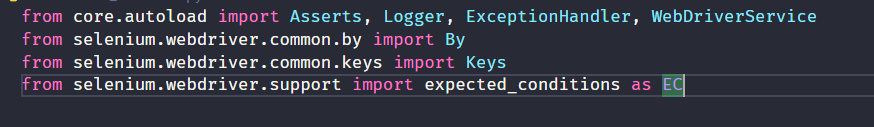

# 🐑 Sheep – Framework de Automação Web

  

**Sheep** é um framework de automação web desenvolvido totalmente do zero por mim, com foco em simplicidade, escalabilidade e boas práticas de Programação Orientada a Objetos.

Ele oferece uma camada de abstração sobre o Selenium, tornando o desenvolvimento de automações, sejam testes automatizados ou rotinas de RPA, mais intuitivo, organizado e eficiente.

Ideal para quem busca controle total sobre seus testes e deseja evoluir tecnicamente por meio da criação de soluções robustas, reutilizáveis e fáceis de manter.

---

## 🚀 Tecnologias e Conceitos Utilizados

- **Python 3.10+** - Linguagem principal utilizada no desenvolvimento do framework.
- **Selenium WebDriver** - Biblioteca base para interação com navegadores.
- **POO (Programação Orientada a Objetos)** - Paradigma adotado para garantir modularidade, reutilização e escalabilidade do código.
- **WebDriverWait & ExpectedConditions** - Técnicas aplicadas para controle explícito de tempo de espera nos testes.
- **Tratamento customizado de exceções** -  Implementações próprias para capturar, identificar e lidar com erros de forma mais precisa durante a automação.
- **Logger** - Implementação própria, que abstrai Logging nativa do python. Com o objetivo de criar logs consistentes, sendo opcional a ativação de debug logs.
  - 

- **WebDriverService** - Responsável pela instanciação do navegador, bem como configurações do navegador e tempo de espera personalizada pelo usuário.
  - 

- **DataProvider** - Responsável por "providenciar" dados necessários para teste, de forma centralizada e consistente.
  - 
  - 
- **Autoloader** - Responsável por centralizar o carregamento de dependências conforme necessidade no projeto.
  - 

- **Validators** - Responsável por caminhar em conjunto com "tests". Os métodos contidos neste arquivo, são responsáveis por validar ações realizadas em arquivos "test". Enquanto um realiza e executa ações, o outro verifica a persistência e consistência desses dados "inputados".

- **Soft Asserts** - Implentação própria que abstrai o uso de asserts, nativo do python, contendo verificação, contagem de sucessos e falhas, e posteriormente relatório HTML para auditoria do teste.  
---

---

## ✨ Principais Funcionalidades

- Encapsulamento de interações com o Selenium
- Acesso fluente a métodos:  
  `controller.acessar_site(...).buscar_elemento(...).preencher(...)`
- Tratamento próprio, de exceções customizado com logs customizados.
- Estrutura extensível com suporte a Page Objects e Wrappers

### 📝To do list

- Implementação de CLI. Geração de testes e validadores de forma abstrata. ("python sheep make:test")
- Relatório customizavel, para acompanhamento do andamento das automações. (Sucesso;Erro;Falhas Críticas)
- Novo Repositório **privado** para escalar o projeto, sem que fique totalmente público.
- **Helper**, responsável por ser o ajudante de uso ao CLI implementado, dentre outras funções auxiliares.

---

